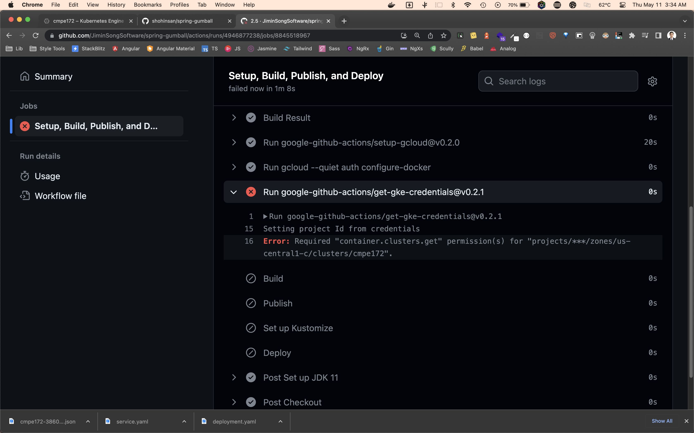

# CMPE 172 - Lab #10 - DevOps CI/CD Report

## Introduction

This report outlines the steps taken to complete Lab #10 of the CMPE 172 course. The lab involved setting up a Continuous Integration (CI) and Continuous Deployment (CD) pipeline using GitHub Workflows and GitHub Actions.

In the process, we created a public repository named "spring-gumball" in our personal GitHub account and used Gradle v5.6 as the build tool along with Java JDK 11.

## CI Workflow

Firstly, we set up the CI workflow by adding a `gradle.yml` file in the `.github/workflows` directory of the repository. This file defined the actions to be taken upon a push or pull request to the main branch. Actions included setting up JDK 11, granting execute permission to the Gradle wrapper, building with Gradle, listing the build output to confirm that the JAR file was built, and uploading the build artifact.

Upon making changes to the code and committing to the main branch, the action was successfully triggered.

## CD Workflow

For the CD workflow, we first had to set up a Google Kubernetes Engine (GKE) cluster and enable the necessary APIs. We used the standard settings for the cluster creation and enabled the Kubernetes Engine and Container Registry APIs.

Next, we set up Secrets in the GitHub repository. This included creating a service account for GitHub Access with appropriate permissions and storing the service account key and GKE project ID in the repository's secrets.

We then configured a `google.yml` file in the `.github/workflows` directory. This file defined actions to be taken upon a release being created. The actions included setting up JDK 11, building with Gradle, setting up the gcloud CLI, configuring Docker for authentication with gcloud, building a Docker image, pushing the image to the Google Container Registry, and deploying the image to the GKE cluster.

Upon creating a release, the CD workflow was successfully triggered.

## CI/CD Workflow Results

Screenshots:

Screenshots:

## Conclusion

In conclusion, we successfully set up a CI/CD pipeline for the spring-gumball project using GitHub Workflows and GitHub Actions. This pipeline automates the processes of building the project upon each push or pull request and deploying the project upon each release, ensuring that our application is always up-to-date and reducing the risk of manual errors in the deployment process.

Please find the link to the GitHub repository [here](https://github.com/JiminSongSoftware/spring-gumball).
